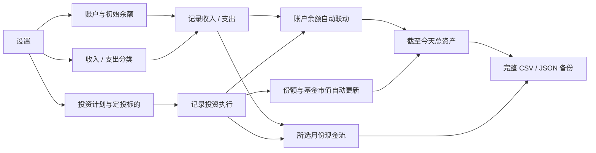

<div align="center">

# 钱途花园

**把每天的一笔收支，慢慢种成看得见的资产。**

一款本机优先的个人财务工具：把收入、支出、账户余额与基金投资放进同一套可追溯的账本，自动回答两个最重要的问题——**这个月的钱去了哪里，以及截至今天我一共有多少钱。**

[在线体验](https://qiantu-huayuan.jguo2780.chatgpt.site/) · [产品需求文档（PRD）](https://ucnvqs2nk9a7.feishu.cn/docx/MB6pdmYMAomqfgxKIzycMcGCnee) · [本机运行](#本机运行) · [数据口径](#数据是怎么算的) · [隐私与迁移](#隐私与迁移)

</div>

> 截图使用虚构演示数据。在线版的数据只保存在访问者自己的浏览器中，不会展示仓库作者的私人账本。

## 它解决了哪些痛点

| 长期记账时的真实痛点 | 钱途花园的解决方式 |
| --- | --- |
| Excel 表越记越多，余额、流水和投资分散，公式还容易算错 | 收支、账户、基金份额和当前市值共用一套数据，所有汇总都能回到原始记录 |
| 想看“现在有多少钱”，却被某个月份筛选成历史快照 | **总资产永远统计截至今天**；月份只筛选左侧月度现金流和对应页面的历史记录 |
| 填了账户初始余额，之后还要手工修改银行卡余额 | 初始余额只填一次，收入、支出和投资交易会自动增减所选账户 |
| 定投计划、基金配置和真实成交挤在同一页，长期使用容易混乱 | 设置页管理计划与定投标的；定投页只记录买入、卖出、分红和费用 |
| 只记买了多少钱，事后无法复盘当时为什么买 | 每笔投资可保存份额、成交价、手续费、估值、数据来源、计算口径和偏离原因，列表按需展开详情 |
| 分类和账户固定，不能适应工资卡、生活卡或新的支出习惯 | 账户、收入分类和支出分类都可自定义；分类可直接删除，收入与支出分开管理 |
| 换浏览器、换电脑或离开某个平台后，账本很难带走 | 本机模式支持同一电脑跨浏览器共用数据；完整 CSV 可查阅，JSON 可无损备份与恢复 |
| 银行卡和资产数据太私人，不想交给云端账户 | 无需注册；本机共享数据写在本地，线上体验数据也只留在访问者当前浏览器 |

## 新版页面怎么分工

新版不再让一个月份筛选或一张大表控制所有内容。每个页面只承担一种职责：

| 区域 / 页面 | 只负责什么 | 会联动到哪里 |
| --- | --- | --- |
| 左侧常驻看板 | 截至今天的总资产、资产分布，以及用户所选月份的现金流 | 汇总全部账户、收支和投资记录，但不会反向修改事实数据 |
| 收入 | 工资、红包、奖金等真实入账 | 增加所选账户余额，进入对应月份收入统计 |
| 支出 | 住宿、餐饮、交通等真实出账 | 减少所选账户余额，进入对应月份支出统计 |
| 定投 | 只记录已经发生的买入、卖出、分红与费用 | 更新账户资金、基金份额、投资现金流和当前资产 |
| 资产 | 查看截至今天的账户余额、基金市值与其他理财 | 修改当前净值只改变当前估值，不篡改历史成交 |
| 设置 | 管理投资计划、定投标的、账户、收支分类和数据迁移 | 为其他页面提供选项与计算基础 |

所有日期按北京时间处理，所有金额和净值以人民币计。桌面端采用横向一屏布局，常用记录、查看和配置无需在多张表之间来回切换。

## 页面预览

### 收入与支出分开记录，余额自动联动

每笔流水只需填写日期、分类、账户、金额和可选备注。分类与账户在设置页统一维护，新增后会立即出现在记录表单中。


### 定投页只记录已经发生的投资

长期计划和基金 / ETF 标的放在设置页，避免与历史交易混为一谈。定投页专注记录执行：成交金额、份额、成交价、手续费与当时的估值依据完整保存；主表保持紧凑，需要复盘时再打开估值详情。

### 总资产看“今天”，月度收支看“当月”

资产页展示各账户的当前余额、基金持有份额与当前市值。更新基金当前净值只会改变当前估值，不会篡改历史成交记录。


## 产品文档

想了解这个项目为什么这样设计、各页面如何衔接，以及每个数字应当怎样计算，可以阅读飞书文档：[《钱途花园｜长期使用产品需求文档 v1.1》](https://ucnvqs2nk9a7.feishu.cn/docx/MB6pdmYMAomqfgxKIzycMcGCnee)。文档包含产品目标、信息架构、页面职责、核心流程、数据口径、异常处理和长期迭代原则。

## 数据是怎么算的

| 指标 | 计算口径 |
| --- | --- |
| 账户当前余额 | 初始余额 + 截至今天流入该账户的收入 − 支出 ± 投资交易影响 |
| 基金当前市值 | 截至今天持有份额 × 当前净值 |
| 人民币总资产 | 所有账户当前余额 + 基金当前市值 + 其他理财当前市值 |
| 当月日常净结余 | 所选月份收入 − 所选月份支出 |
| 当月净现金变化 | 日常净结余 + 所选月份投资现金流 |

未来日期的记录不会提前计入当前资产。买入、卖出、分红和费用会根据交易类型分别影响账户余额、基金份额与投资现金流，避免把基金买入重复算成“资产消失”。

## 一次完整的使用流程



## 本机运行

需要 Node.js `>=22.13.0`。

```bash
git clone https://github.com/guojiayu-ai/qiantu-huayuan.git
cd qiantu-huayuan
npm install
npm run dev:shared
```

打开 [http://localhost:3000](http://localhost:3000)。`dev:shared` 会同时启动网页和本机数据服务，Chrome、Safari 等浏览器只要访问同一台电脑上的这个地址，就会读取同一份本机账本。

仅做界面开发时也可以运行：

```bash
npm run dev
```

## 隐私与迁移

- 在线版：数据保存在当前浏览器的本地存储中；换浏览器不会自动出现原数据。
- 本机共享版：数据写入项目下的 `.local-data/`，该目录已被 Git 忽略，不会随代码上传 GitHub。
- 完整 CSV：包含账户、分类、全部收支、定投计划、标的和交易，适合长期查阅与二次分析。
- JSON 备份 / 恢复：保留应用完整结构，适合换电脑或浏览器时无损迁移。
- 项目不要求注册账户，也不会主动上传银行卡余额或交易记录。

仍建议定期下载 JSON 备份，并把备份文件放在你自己可信的加密磁盘或私人云盘中。

## 开发与验证

```bash
npm test
npm run lint
npm run build
```

主要技术栈：React、TypeScript、Vinext / Vite，以及一个只在本机运行的轻量数据服务。

## 项目原则

1. **账要算对。** 页面展示必须能追溯到唯一事实来源，避免余额与流水重复计算。
2. **现在与历史分开。** 总资产回答“今天有多少”，月份筛选回答“那个月发生了什么”。
3. **默认保护隐私。** 个人财务数据留在本机，公开仓库只保存程序代码和虚构演示截图。
4. **能长期带走。** 不把数据锁进网站，随时可以导出、备份和恢复。

---

如果这个项目对你有帮助，欢迎点一个 Star。更重要的是：从今天的一笔开始，把自己的钱看清楚。
