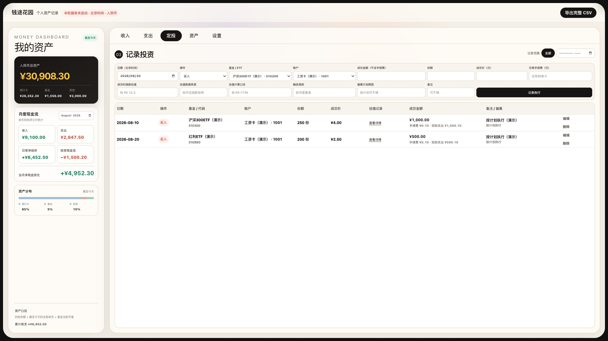
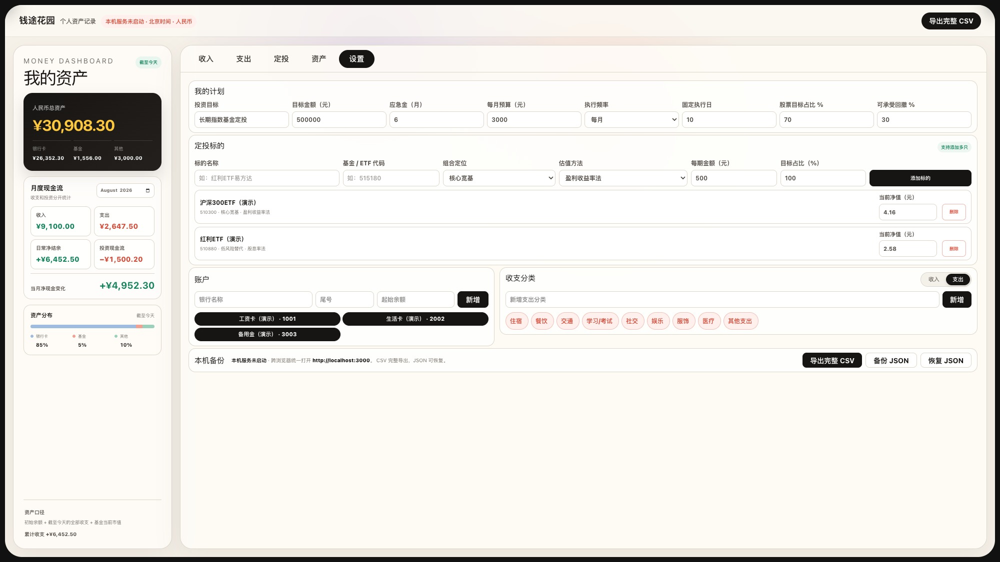
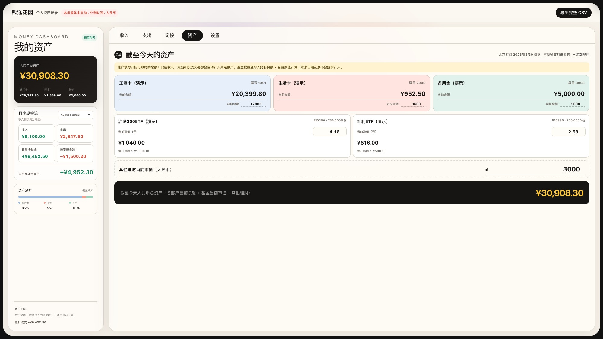
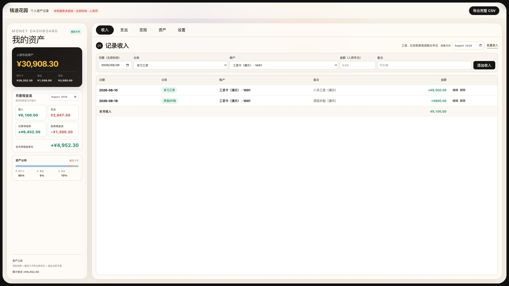
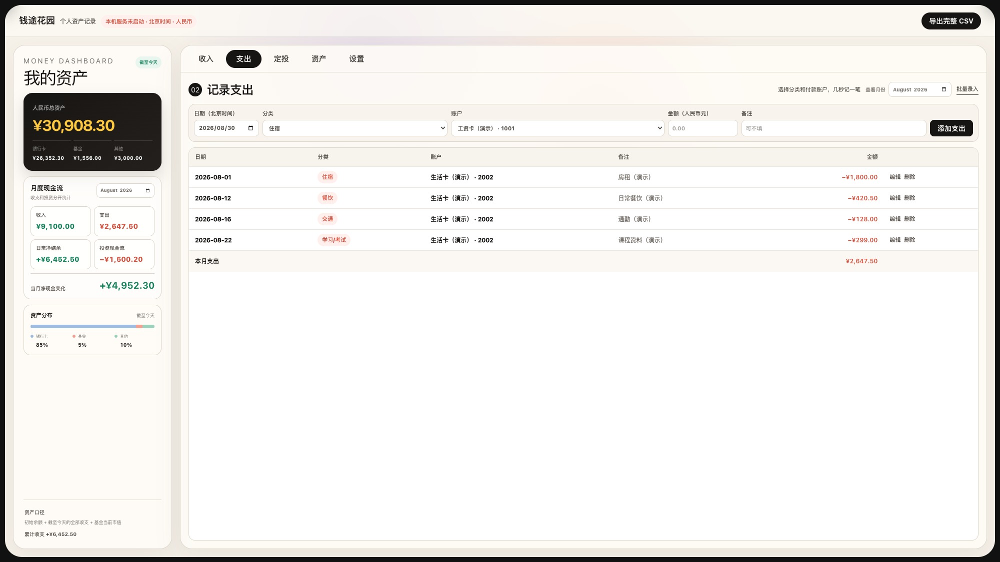
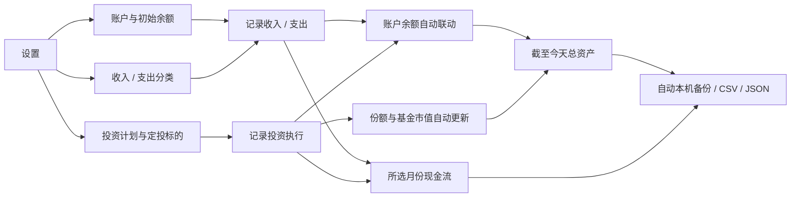

<div align="center">

# 钱途花园

**以指数基金定投为核心，把每次执行、当前资产和每月现金流放进同一本账。**

一款本机优先的个人定投与资产管理工具：先明确长期计划和定投标的，再记录每次真实成交与当时的估值依据；账户余额、基金持仓和收支分析自动联动，让你随时看清——**定投有没有按计划执行、截至今天有多少资产、这个月的钱去了哪里。**

[在线体验](https://qiantu-huayuan.jguo2780.chatgpt.site/) · [产品需求文档（PRD）](https://ucnvqs2nk9a7.feishu.cn/docx/MB6pdmYMAomqfgxKIzycMcGCnee) · [本机运行](#本机运行) · [数据口径](#数据是怎么算的) · [隐私与迁移](#隐私与迁移)

</div>

> 截图使用虚构演示数据。在线版的数据只保存在访问者自己的浏览器中，不会展示仓库作者的私人账本。

## 它解决了哪些痛点

| 长期记账时的真实痛点 | 钱途花园的解决方式 |
| --- | --- |
| 定投计划、标的配置、真实成交和复盘依据散落在不同表格 | 设置页管理长期计划与定投标的，定投页专门记录真实执行，形成可持续复盘的闭环 |
| 只记“买了多少钱”，过后说不清当时为什么买、是否按计划 | 每笔投资保存份额、成交价、手续费、估值、数据来源、计算口径、触发规则和偏离原因 |
| 买入基金后，银行卡减少、基金份额增加，手工统计容易漏算或重复算 | 一笔投资同时联动账户资金、基金份额、投资现金流和当前资产，所有结果回到同一事实记录 |
| 想看“现在有多少钱”，却被某个月份筛选成历史快照 | **总资产永远统计截至今天**；月份只筛选月度现金流和需要回看的历史记录 |
| 填了账户初始余额，之后还要手工修改银行卡余额 | 初始余额只填一次，收入、支出和投资交易会自动增减所选账户 |
| Excel 表越记越多，余额、流水和投资分散，公式还容易算错 | 收支、账户、基金份额和当前市值共用一套数据，所有汇总都能追溯到原始记录 |
| 分类和账户固定，不能适应工资卡、生活卡或新的支出习惯 | 账户、收入分类和支出分类都可自定义；分类可直接删除，收入与支出分开管理 |
| 换浏览器、换电脑或离开某个平台后，账本很难带走 | 本机模式让完整记录从第一笔起长期留存，并支持同一电脑跨浏览器共用；顶部可直接导入 JSON，无需每月手工维护 |
| 银行卡和资产数据太私人，不想交给云端账户 | 无需注册；本机共享数据写在本地，线上体验数据也只留在访问者当前浏览器 |

## 新版页面怎么分工

5 个页面围绕“设定计划 → 记录定投 → 更新资产 → 分析现金流”协同工作，而不是让一张大表或一个月份筛选控制所有内容：

| 区域 / 页面 | 只负责什么 | 会联动到哪里 |
| --- | --- | --- |
| 左侧常驻看板 | 截至今天的总资产、资产分布，以及用户所选月份的现金流 | 汇总全部账户、收支和投资记录，但不会反向修改事实数据 |
| 定投（核心） | 记录已经发生的买入、卖出、分红与费用，并保留当时的估值和决策依据 | 更新账户资金、基金份额、投资现金流和当前资产，支持长期复盘 |
| 设置 | 管理投资计划、定投标的、账户、收支分类和数据迁移 | 为定投、资产和收支页面提供选项与计算基础 |
| 资产 | 查看截至今天的账户余额、基金市值与其他理财 | 修改当前净值只改变当前估值，不篡改历史成交 |
| 收入 | 工资、红包、奖金等真实入账 | 增加所选账户余额，进入对应月份收入统计 |
| 支出 | 住宿、餐饮、交通等真实出账 | 减少所选账户余额，进入对应月份支出统计 |

所有日期按北京时间处理，所有金额和净值以人民币计。桌面端采用横向一屏布局，常用记录、查看和配置无需在多张表之间来回切换。

## 五个页面，一条完整的定投闭环

### 1. 定投：核心工作台

这里不写空泛的投资愿望，只记录已经发生的执行。每笔买入、卖出或分红都可以保存日期、标的、账户、成交金额、份额、成交价和手续费；估值数值、数据来源、计算口径、触发规则与偏离原因也会一起留档。列表默认展示全部记录，只有主动选择月份时才筛选；日常查看保持紧凑，需要复盘时再展开估值详情。



### 2. 设置：先把计划与标的定清楚

长期目标、应急金、月度预算、执行频率和风险边界单独维护；基金 / ETF 名称、代码、组合定位、估值方法、每期金额与目标占比也在这里配置。账户和收支分类作为基础资料统一管理，避免和真实交易混在一起。



### 3. 资产：看截至今天的配置结果

资产页展示各账户的当前余额、基金持有份额与当前市值。更新基金当前净值只会改变当前估值，不会篡改历史成交记录。



### 4. 收入：资金从哪里来

工资、奖金、红包等收入按账户和自定义分类记录。新增收入会自动增加对应账户余额，并进入所选月份的现金流分析，不需要再次手工修改资产。



### 5. 支出：钱花到哪里去

住宿、餐饮、交通等支出独立记录，分类可以自定义维护。新增支出会自动减少对应账户余额；月度筛选只负责复盘当月消费，不会改变“截至今天”的总资产口径。



## 产品文档

想了解这个项目为什么这样设计、各页面如何衔接，以及每个数字应当怎样计算，可以阅读飞书文档：[《钱途花园｜长期使用产品需求文档 v1.1》](https://ucnvqs2nk9a7.feishu.cn/docx/MB6pdmYMAomqfgxKIzycMcGCnee)。文档包含产品目标、信息架构、页面职责、核心流程、数据口径、异常处理和长期迭代原则。

## 数据是怎么算的

| 指标 | 计算口径 |
| --- | --- |
| 账户当前余额 | 初始余额 + 截至今天流入该账户的收入 − 支出 ± 投资交易影响 |
| 基金当前市值 | 截至今天持有份额 × 当前净值 |
| 人民币总资产 | 所有账户当前余额 + 基金当前市值 + 其他理财当前市值 |
| 当月日常净结余 | 所选月份收入 − 所选月份支出 |
| 当月净现金变化 | 日常净结余 + 所选月份投资现金流 |

未来日期的记录不会提前计入当前资产。买入、卖出、分红和费用会根据交易类型分别影响账户余额、基金份额与投资现金流，避免把基金买入重复算成“资产消失”。

## 一次完整的使用流程



## 本机运行

需要 Node.js `>=22.13.0`。

```bash
git clone https://github.com/guojiayu-ai/qiantu-huayuan.git
cd qiantu-huayuan
npm install
npm run dev:shared
```

打开 [http://localhost:3000](http://localhost:3000)。`dev:shared` 会同时启动网页和本机数据服务，Chrome、Safari 等浏览器只要访问同一台电脑上的这个地址，就会读取同一份本机账本。

仅做界面开发时也可以运行：

```bash
npm run dev
```

## 隐私与迁移

- 在线版：数据保存在当前浏览器的本地存储中；换浏览器不会自动出现原数据。
- 本机共享版：完整账本写入项目下的 `.local-data/`，从第一笔记录起长期保存，不按月份清理；每次修改自动保存，并在 `.local-data/backups/` 按北京时间额外保留最近 30 份恢复快照。该目录已被 Git 忽略，不会随代码上传 GitHub。
- 完整 CSV：包含账户、分类、全部收支、定投计划、标的和交易，适合长期查阅与二次分析。
- JSON 备份 / 导入：顶部的“导入备份”可以恢复完整应用结构，适合换电脑或浏览器时无损迁移。
- 项目不要求注册账户，也不会主动上传银行卡余额或交易记录。

日常使用无需按月导出。只有换电脑、长期归档或希望增加异地容灾时，才需要手动下载 JSON，并放到你自己可信的加密磁盘或私人云盘中。

## 开发与验证

```bash
npm test
npm run lint
npm run build
```

主要技术栈：React、TypeScript、Vinext / Vite，以及一个只在本机运行的轻量数据服务。

## 项目原则

1. **账要算对。** 页面展示必须能追溯到唯一事实来源，避免余额与流水重复计算。
2. **现在与历史分开。** 总资产回答“今天有多少”，月份筛选回答“那个月发生了什么”。
3. **默认保护隐私。** 个人财务数据留在本机，公开仓库只保存程序代码和虚构演示截图。
4. **能长期带走。** 不把数据锁进网站，随时可以导出、备份和恢复。

---

如果这个项目对你有帮助，欢迎点一个 Star。更重要的是：从今天的一笔开始，把自己的钱看清楚。
