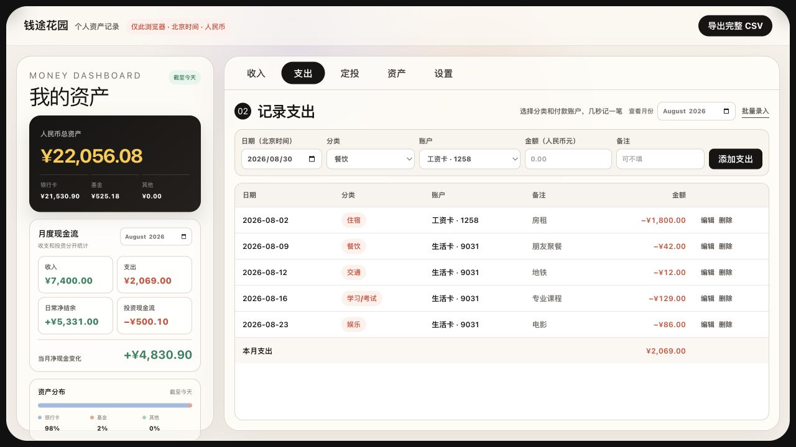
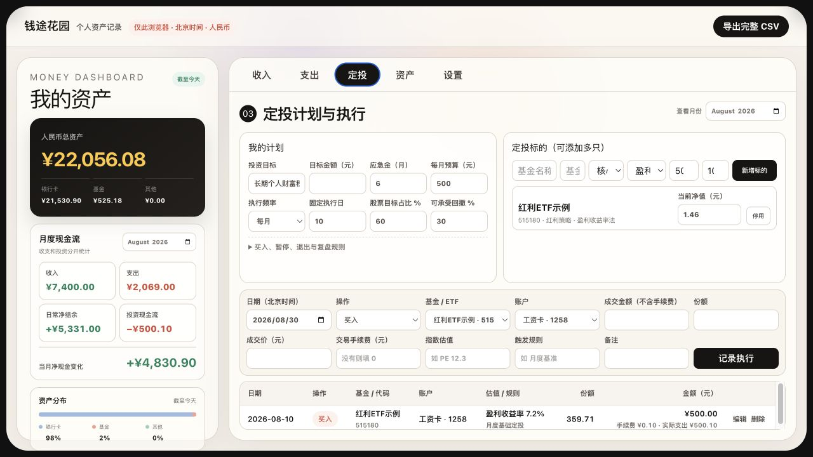
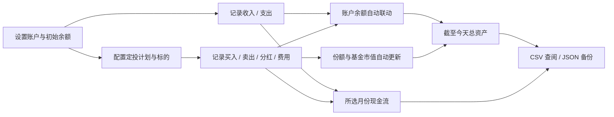

<div align="center">

# 钱途花园

**把每天的一笔收支，慢慢种成看得见的资产。**

一款本机优先的个人财务工具：在同一张账本里记录收入、支出、账户余额和指数基金定投，自动算清“这个月花了多少”和“截至今天一共有多少钱”。

[在线体验](https://qiantu-huayuan.jguo2780.chatgpt.site/) · [本机运行](#本机运行) · [数据口径](#数据是怎么算的) · [隐私与迁移](#隐私与迁移)

</div>

> 截图使用虚构演示数据。在线版的数据只保存在访问者自己的浏览器中，不会展示仓库作者的私人账本。



## 它适合谁

钱途花园面向想长期记账、但不想维护复杂 Excel 的个人用户。它没有社交、广告和理财推销，重点只有三件事：快速记一笔、把账户余额算对、把定投计划真正执行下去。

- 收入和支出分开记录，分类、账户均可自定义。
- 只填写一次账户初始余额，后续收支和投资交易会自动更新对应账户。
- 月度看板独立选择月份；总资产始终按“截至今天”计算，不被月份筛选误伤。
- 一套页面同时管理定投规则、多个基金 / ETF、基金代码、当前净值和交易历史。
- 全量 CSV 用于查阅分析，JSON 用于完整备份与恢复。
- 北京时间、人民币口径，桌面端横向一屏即可完成日常操作。

## 页面预览

### 定投不是一行备注，而是一套可以执行的计划

定投页把长期目标、应急金、月度预算、标的估值方法和每次成交放在一起。支持添加多只基金 / ETF，并保留代码、份额、成交价、手续费、触发规则与备注。



### 总资产看“今天”，月度收支看“当月”

资产页展示各账户的当前余额、基金持有份额与当前市值。更新基金当前净值只会改变当前估值，不会篡改历史成交记录。


## 数据是怎么算的

| 指标 | 计算口径 |
| --- | --- |
| 账户当前余额 | 初始余额 + 截至今天流入该账户的收入 − 支出 ± 投资交易影响 |
| 基金当前市值 | 截至今天持有份额 × 当前净值 |
| 人民币总资产 | 所有账户当前余额 + 基金当前市值 + 其他理财当前市值 |
| 当月日常净结余 | 所选月份收入 − 所选月份支出 |
| 当月净现金变化 | 日常净结余 + 所选月份投资现金流 |

未来日期的记录不会提前计入当前资产。买入、卖出、分红和费用会根据交易类型分别影响账户余额、基金份额与投资现金流，避免把基金买入重复算成“资产消失”。

## 一次完整的使用流程



## 本机运行

需要 Node.js `>=22.13.0`。

```bash
git clone https://github.com/guojiayu-ai/qiantu-huayuan.git
cd qiantu-huayuan
npm install
npm run dev:shared
```

打开 [http://localhost:3000](http://localhost:3000)。`dev:shared` 会同时启动网页和本机数据服务，Chrome、Safari 等浏览器只要访问同一台电脑上的这个地址，就会读取同一份本机账本。

仅做界面开发时也可以运行：

```bash
npm run dev
```

## 隐私与迁移

- 在线版：数据保存在当前浏览器的本地存储中；换浏览器不会自动出现原数据。
- 本机共享版：数据写入项目下的 `.local-data/`，该目录已被 Git 忽略，不会随代码上传 GitHub。
- 完整 CSV：包含账户、分类、全部收支、定投计划、标的和交易，适合长期查阅与二次分析。
- JSON 备份 / 恢复：保留应用完整结构，适合换电脑或浏览器时无损迁移。
- 项目不要求注册账户，也不会主动上传银行卡余额或交易记录。

仍建议定期下载 JSON 备份，并把备份文件放在你自己可信的加密磁盘或私人云盘中。

## 开发与验证

```bash
npm test
npm run lint
npm run build
```

主要技术栈：React、TypeScript、Vinext / Vite，以及一个只在本机运行的轻量数据服务。

## 项目原则

1. **账要算对。** 页面展示必须能追溯到唯一事实来源，避免余额与流水重复计算。
2. **现在与历史分开。** 总资产回答“今天有多少”，月份筛选回答“那个月发生了什么”。
3. **默认保护隐私。** 个人财务数据留在本机，公开仓库只保存程序代码和虚构演示截图。
4. **能长期带走。** 不把数据锁进网站，随时可以导出、备份和恢复。

---

如果这个项目对你有帮助，欢迎点一个 Star。更重要的是：从今天的一笔开始，把自己的钱看清楚。
